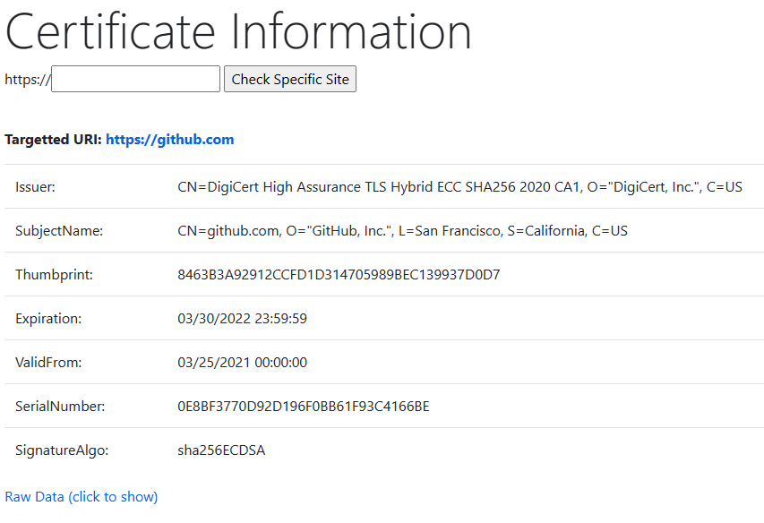

# Cert Tester

This is a small web app that will return information about the HTTPS certificate for a given website.

## Usage

Build Cert Tester and then deploy the resulting Dockerfile. This .NET web app was tested/designed to be run in Azure, but can be deployed anywhere you can run .NET Docker containers.

Navigate to your deployment of the app, and by default it will show you information about the certificate bound to itself. You can supply a website to check deliberately as pictured below.

Click `Raw Data` to see all the data embedded in the certificate.